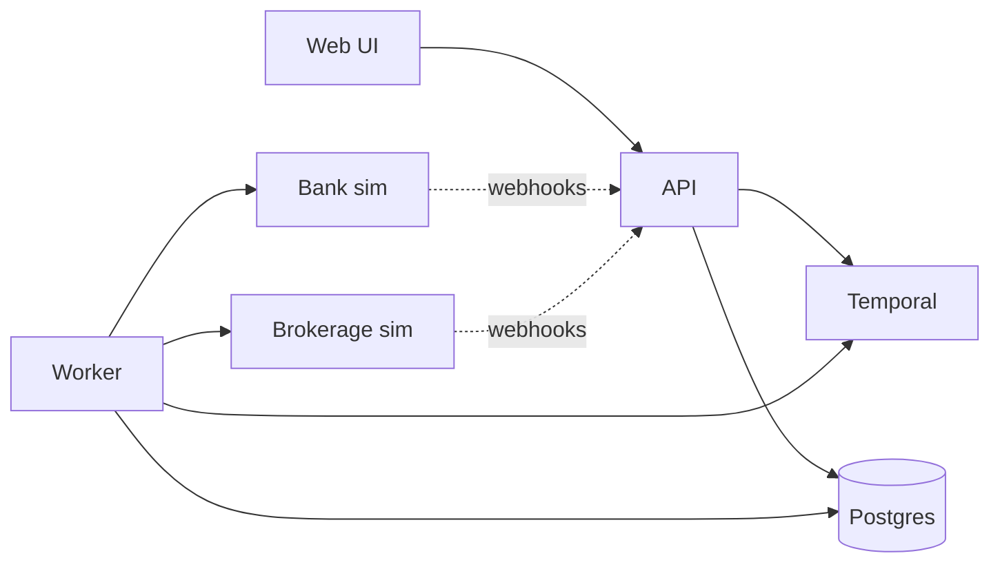

# Canadian Smith Manoeuvre Simulator

Multi-tenant **simulator** for the Canadian Smith Manoeuvre: mortgage principal paydown → HELOC readvance → borrow from HELOC → transfer to brokerage → buy ETF. Orchestration uses **Temporal Schedules and Workflows**. Money is CAD integer cents.

**This does not move real money, provide investment advice, or determine tax outcomes.** HELOC leverage increases debt and interest costs; investments can lose value.

Deep docs live in [`docs/`](./docs/README.md).

---

## How it works



### Monthly conversion (happy path)

1. Strategy is **ACTIVE** → Temporal **Schedule** fires after the expected mortgage payment day (09:00 local).
2. Kickoff starts `monthlyConversionWorkflow` for period `YYYY-MM`.
3. Worker waits until mortgage payment is **settled** and HELOC credit is **readvanced**.
4. Draw amount = min(principal repaid, available HELOC, user cap, platform cap).
5. HELOC draw → transfer to brokerage → deposit → ETF order (idempotent provider calls).
6. Cycle reconciles and lands **Completed** (or Skip / Pause / Fail with reasons).

HELOC **interest** is a separate Schedule/Workflow: charge posts on the HELOC, debit comes from the **ordinary chequing** account (never investment proceeds).

### Main components

| Piece | Role |
| ----- | ---- |
| `apps/api` | Fastify API: auth, strategies, connections, webhooks, ops |
| `apps/worker` | Temporal worker (task queue `smith-manoeuvre`) |
| `apps/bank-simulator` | Mortgage / HELOC / ordinary account + accelerated clock |
| `apps/brokerage-simulator` | Non-registered cash + ETF orders |
| `apps/web` | Customer + operations UI |
| `apps/demo` | Edmonton seed, clock drive, e2e proofs |
| `packages/temporal-workflows` | Deterministic workflows + kickoffs |
| `packages/temporal-activities` | Side-effecting activities (DB + providers) |
| `packages/database` | Prisma / PostgreSQL |

### Money safety (simulation)

- Amounts stored as **bigint cents** (no float money math).
- Provider POSTs use idempotency keys; uncertain transport → resolve before retry (`AMBIGUOUS_RESULT`).
- Temporal Schedule overlap policy **SKIP**; deterministic workflow IDs per tenant/strategy/period.

---

## Prerequisites

- Node.js **20+**
- pnpm **10+** (`packageManager` pinned in root `package.json`)
- Docker + Docker Compose

---

## How to run

### 1. Install

```bash
cp .env.example .env
pnpm install
pnpm db:generate
```

Compose Postgres defaults: user/password/db `smith` / `smith` / `smith_manoeuvre`.

### 2. Start the full stack

```bash
docker compose up --build -d
```

Migrations run via the one-shot `migrate` service before API/worker start.

### 3. Seed the Edmonton demo household

Demo CLIs use the repo `.env` / Compose DB URL (not a stale shell `DATABASE_URL`). Override with `CSM_DATABASE_URL` if needed.

```bash
pnpm --filter @csm/demo seed -- --scenario edmonton-demo
```

### 4. Open the apps

| Service | URL |
| ------- | --- |
| Web | http://localhost:3000 |
| API health / ready | http://localhost:3001/health · `/ready` |
| OpenAPI | http://localhost:3001/docs |
| Bank sim | http://localhost:3002/health |
| Brokerage sim | http://localhost:3003/health |
| Worker health | http://localhost:3100/health |
| Temporal UI | http://localhost:8080 |
| Postgres | `localhost:5432` |
| Temporal gRPC | `localhost:7233` |

---

## Baby steps: run the app in the browser

Do this after `docker compose up --build -d` and (for the demo household) after seeding.

### Before you click anything

1. Wait ~1–2 minutes after Compose starts so API, web, and worker become healthy.
2. In a terminal, confirm the web app answers:

```bash
curl -sf http://localhost:3000/api/health
```

You should see JSON with `"status":"ok"`.

3. Seed the demo (if you have not already):

```bash
pnpm --filter @csm/demo seed -- --scenario edmonton-demo
```

Keep the printed `tenantId` / `strategyId` if you will use Temporal later.

### Open the product UI

1. Open Chrome / Safari / Firefox.
2. Go to **http://localhost:3000**.
3. You should see the landing page titled **Canadian Smith Manoeuvre** with a leverage disclosure and two buttons: **Sign in** and **Operations**.
4. Click **Sign in**.

### Sign in as the demo customer

1. On **http://localhost:3000/login**, the form should list households (not an error box).
2. **Simulated household** → choose **Edmonton Demo Household (edmonton-demo)**.
3. **User** → choose **Pat Edmonton — pat.edmonton@example.ca**.
4. **Role** → select **Customer**.
5. Click **Sign in**.
6. You land on the **Dashboard**.

What “good” looks like on the Dashboard:

- Badge: **Automation active**
- ETF mentioned (e.g. **XEQT**)
- Metrics may still be empty (`—` / `$0.00`) until a conversion workflow finishes
- **Next expected check** is informational only (you do not edit it)

### Click around the customer pages (top nav)

| Click | What you should see |
| ----- | ------------------- |
| **Dashboard** | Strategy overview + automation metrics |
| **Strategy** | ETF, monthly cap, timezone, Pause / Resume |
| **Activity** | Monthly cycles (empty until a conversion runs) |
| **Interest** | HELOC interest history (empty until interest workflow runs) |
| **Documents** | Document placeholders / list |
| **Settings** | Your session identity (name, email, roles, tenant) |
| **Onboarding** | Optional wizard (bank → brokerage → ETF → activate) |
| **Sign out** | Returns you to the public landing / login flow |

### Sign in as Operations (same browser)

1. Click **Sign out** (or open http://localhost:3000 again).
2. Click **Operations** on the home page, **or** open http://localhost:3000/login?role=OPERATIONS.
3. Pick the same **Edmonton Demo Household** / **Pat Edmonton**.
4. Role → **Operations**.
5. Click **Sign in** → you land on **Operations · Cycles**.

Ops nav pages:

| Click | Purpose |
| ----- | ------- |
| **Cycles** | Open a cycle row → provider trail, amounts, Temporal link |
| **Exceptions** | Open operational exceptions |
| **Webhooks** | Inbound provider webhook events |
| **Reconciliation** | Recon items for cycles |
| **Workflows** | Temporal workflow references for the tenant |

If login shows **fetch failed** / **Start the API and seed data**, go back to Compose health and re-seed (see gotchas below).

---

## Baby steps: run Temporal in the browser

Temporal UI is a separate website from the product app. Use it to **see** and **start** workflows without waiting for the next calendar month.

### Open Temporal UI

1. Make sure Compose is up (`docker compose up -d` if needed).
2. Open **http://localhost:8080** in your browser.
3. You should see the Temporal Web UI for namespace **default**.

If the page does not load, Temporal is not ready yet — wait and refresh, or check:

```bash
docker compose ps temporal temporal-ui
```

### Find your Schedules (baby steps)

1. In the left sidebar, click **Schedules**.
2. You should see rows like:
   - `monthly-conversion-schedule/{tenantId}/{strategyId}`
   - `heloc-interest-schedule/{tenantId}/{strategyId}`
3. Click the **monthly-conversion** schedule row to open its detail page.
4. Confirm:
   - **Paused** = false / not paused
   - **Task Queue** related action uses `smith-manoeuvre`
   - **Next run** may be weeks away — that is normal

### Trigger a conversion now (do not wait for the calendar)

1. Stay on the monthly-conversion schedule detail page.
2. Find and click **Trigger** (sometimes labeled **Trigger now** / run action in the schedule menu).
3. Confirm the trigger when asked.
4. Go to **Workflows** in the left sidebar.
5. Refresh the list.

You should soon see two related runs:

| Workflow type | Typical status | Meaning |
| ------------- | -------------- | ------- |
| `monthlyConversionScheduleKickoff` | **Completed** in ~1s | Schedule successfully started the child |
| `monthlyConversionWorkflow` | Running → later **Completed** or **Failed** | Real conversion work |

### Inspect a workflow (baby steps)

1. In **Workflows**, click the `monthlyConversionWorkflow` row (ID starts with `monthly-conversion/...`).
2. Read the top status badge (**Running** / **Completed** / **Failed**).
3. Open the **History** tab — scroll events from bottom (oldest) to top (newest).
4. Open **Input** — you should see `tenantId`, `strategyId`, `paymentPeriod` (often `2026-07` for Edmonton).
5. If **Failed**, open the failure / last activity error (common first-time message: mortgage not settled yet).

### Feed the bank simulator so the workflow can finish

The Temporal UI starts the workflow; the **bank/brokerage sims** must still have a settled mortgage + HELOC readvance.

In a terminal (leave it open):

```bash
pnpm --filter @csm/demo scenario -- --scenario edmonton-demo --keepAlive
```

Then:

1. Return to Temporal UI → **Workflows**.
2. Refresh until `monthlyConversionWorkflow` is **Completed**.
3. Return to the product UI at **http://localhost:3000** → sign in as Customer → **Dashboard**.
4. Expect borrowed / invested ≈ **$770** and **Latest cycle status → Completed**.

### Optional: trigger HELOC interest in the browser

1. Temporal UI → **Schedules**.
2. Open `heloc-interest-schedule/{tenantId}/{strategyId}`.
3. Click **Trigger**.
4. Watch **Workflows** for:
   - `helocInterestScheduleKickoff` → Completed
   - `helocInterestPaymentWorkflow` → Completed (after interest is posted/settled in the sim)

### Optional: start a workflow manually (advanced)

Only if you know the IDs from seed output:

1. Temporal UI → **Workflows** → **Start Workflow**.
2. Fill roughly:
   - **Workflow Type:** `monthlyConversionWorkflow`
   - **Task Queue:** `smith-manoeuvre`
   - **Workflow ID:** `monthly-conversion/{tenantId}/{strategyId}/2026-07`
   - **Input:** a JSON **array** with one object:

```json
[
  {
    "tenantId": "<from seed>",
    "strategyId": "<from seed>",
    "paymentPeriod": "2026-07",
    "expectedPaymentDate": "2026-07-01",
    "timezone": "America/Edmonton",
    "simulatorScenarioId": "edmonton-demo"
  }
]
```

3. Click start, then watch **History**.

Prefer **Schedule → Trigger** for day-to-day testing; it matches production kickoff behavior.

### Host-process alternative (optional)

```bash
docker compose up -d postgres temporal temporal-ui
pnpm db:migrate:deploy
pnpm --filter @csm/bank-simulator dev   # :3002
pnpm --filter @csm/brokerage-simulator dev  # :3003
pnpm --filter @csm/api dev              # :3001
pnpm --filter @csm/worker dev           # :3100
pnpm --filter @csm/web dev              # :3000
```

### Stop

```bash
docker compose down          # keep data
docker compose down -v       # wipe Postgres volume
```

---

## Steps to test it

### A. Automated (CI / local)

```bash
pnpm format:check
pnpm lint
pnpm typecheck

# Package suites used in CI-style gates
pnpm test:failure
pnpm test:replay
pnpm test:demo
```

| Command | What it proves |
| ------- | -------------- |
| `pnpm test:demo` | Edmonton happy path + ambiguous HELOC draw (in-process sims + Temporal test env) |
| `pnpm test:replay` | Workflow history replay fixtures still match |
| `pnpm test:failure` | Domain/API/sim failure packs and activity suites |

### B. Manual UI + Temporal (recommended once)

**1. Stack + seed**

```bash
docker compose up --build -d
pnpm --filter @csm/demo seed -- --scenario edmonton-demo
```

**2. Sign in**

1. Open http://localhost:3000 → **Sign in**
2. Household: **Edmonton Demo Household**
3. User: **Pat Edmonton**
4. Role: **Customer** → Dashboard shows **Automation active**

**3. Advance simulators** (mortgage post → settle → HELOC readvance)

```bash
pnpm --filter @csm/demo scenario -- --scenario edmonton-demo --keepAlive
```

Leave this running so settlement jobs keep progressing.

**4. Trigger Temporal now** (do not wait for next scheduled month)

1. Open http://localhost:8080 → **Schedules**
2. Trigger `monthly-conversion-schedule/{tenantId}/{strategyId}`
3. Workflows list should show:
   - `monthlyConversionScheduleKickoff` → **Completed**
   - `monthlyConversionWorkflow` → should progress toward **Completed** after sim time advances

Alternatively:

```bash
docker compose exec temporal temporal schedule trigger \
  --address temporal:7233 -n default \
  --schedule-id 'monthly-conversion-schedule/<tenantId>/<strategyId>'
```

Find `tenantId` / `strategyId` in the seed JSON output or Temporal Schedules list.

**5. Confirm in the UI**

- Dashboard: borrowed / invested ≈ **$770**, **Latest cycle status → Completed**
- **Activity**: period `2026-07` completed
- Sign in as **Operations** → **Cycles** for internal trail / Temporal links

**6. Optional HELOC interest**

```bash
pnpm --filter @csm/demo scenario -- --scenario edmonton-demo --interest --keepAlive
```

Then trigger the `heloc-interest-schedule/...` schedule in Temporal UI.

### C. Onboarding path (without Edmonton seed)

1. Sign in → **Onboarding** → connect bank + brokerage → ETF → cap → disclose → Activate  
2. Schedules appear in Temporal for that strategy  
3. Still need sim mortgage settlement (or Edmonton scenario) before conversion completes  

**Next expected check** on the dashboard is display-only (computed from payment day). To test earlier, **Trigger** the Schedule in Temporal — do not wait for the calendar date.

### Known local gotchas

| Symptom | Fix |
| ------- | --- |
| Login “fetch failed” | Web needs `API_BASE_URL=http://api:3001` in Compose; API `NODE_ENV=development` for `/auth/dev-*` |
| Demo seed auth failed for user `csm` | Demo ignores stale shell `DATABASE_URL`; uses `.env` / Compose `smith:smith` |
| Worker crash `__register_atfork` | Worker image must be glibc (`bookworm-slim`), not Alpine |
| Workflow Failed: Mortgage / HELOC not found | Simulators not loaded/advanced for that strategy — seed + `demo scenario` first |

---

## Monorepo layout

```
apps/
  api/                  # Fastify API + OpenAPI
  worker/               # Temporal worker
  bank-simulator/       # Mortgage / HELOC / ordinary
  brokerage-simulator/  # Brokerage cash + ETF
  web/                  # Next.js customer + ops UI
  demo/                 # Edmonton seed / clock / e2e
  e2e/                  # Compose stack smoke catalogue
packages/
  contracts/            # Zod schemas, env, states
  domain/               # Money, caps, ledger, recon, schedules
  database/             # Prisma + PostgreSQL
  observability/        # Logs, correlation, metrics, telemetry
  temporal-workflows/   # monthlyConversion + helocInterest + kickoffs
  temporal-activities/  # Activities against DB + provider clients
  bank-client/
  brokerage-client/
  test-support/
```

---

## Quality commands

```bash
pnpm format
pnpm format:check
pnpm lint
pnpm typecheck
pnpm test
```

---

## Further reading

| Doc | Topic |
| --- | ----- |
| [`docs/demo.md`](./docs/demo.md) | Manual Edmonton walkthrough |
| [`apps/demo/README.md`](./apps/demo/README.md) | Demo proofs and scenario numbers |
| [`docs/monthly-conversion-workflow.md`](./docs/monthly-conversion-workflow.md) | Conversion state machine |
| [`docs/temporal-schedules.md`](./docs/temporal-schedules.md) | Schedule identity and fire rules |
| [`docs/operations-runbook.md`](./docs/operations-runbook.md) | Health, metrics, resume |
| [`docs/final-audit.md`](./docs/final-audit.md) | Audit findings / remediations |
