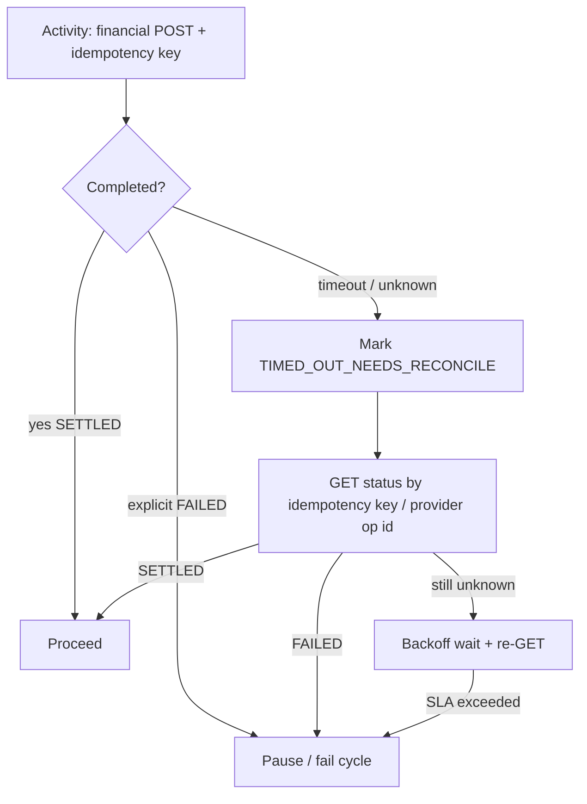
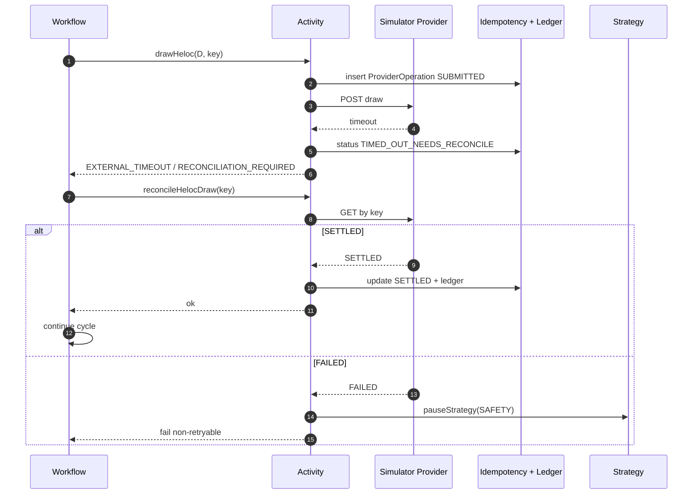

# Failure Model

## Goals

Classify failures so Activities, Workflows, and operators know whether to **retry**, **reconcile**, **pause**, or **ignore (idempotent)**. Blind retries of financial POSTs are forbidden when the prior attempt may have succeeded.

## Failure taxonomy

| Code                         | Category        | Typical cause                             | Default handling                           |
| ---------------------------- | --------------- | ----------------------------------------- | ------------------------------------------ |
| `VALIDATION_ERROR`           | Client / domain | Bad input                                 | Fail fast; no money movement               |
| `UNAUTHORIZED` / `FORBIDDEN` | Security        | AuthZ                                     | Fail; alert if unexpected in worker        |
| `NOT_FOUND`                  | Data            | Missing strategy/payment                  | Pause if expected entity missing mid-cycle |
| `IDEMPOTENCY_CONFLICT`       | Integrity       | Same key, different body                  | Pause + audit                              |
| `EXTERNAL_TIMEOUT`           | Provider        | POST timed out                            | **Reconcile before retry**                 |
| `EXTERNAL_FAILURE`           | Provider        | Explicit fail                             | Pause or business branch                   |
| `RECONCILIATION_REQUIRED`    | Money safety    | Ambiguous provider state                  | Block retry until resolved                 |
| `RECONCILIATION_FAILED`      | Money safety    | Trail imbalance / rule fail               | **Pause strategy**                         |
| `SAFETY_PAUSE`               | Policy          | Cap violation, interest source rule, etc. | Pause strategy                             |
| `INSUFFICIENT_FUNDS`         | Business        | NSF on interest debit                     | Pause or configured policy                 |
| `INTERNAL_ERROR`             | Bug             | Unexpected                                | Retry Activity with backoff; escalate      |

Machine-readable codes align with `@csm/shared` `AppError` codes (Phase 0), extendable per domain.

## Financial POST timeout policy

**Never** generate a new idempotency key to “retry” an unknown POST.

## Failure recovery diagram

## Workflow-level failure handling

| Situation                               | Workflow behaviour                                                                                    |
| --------------------------------------- | ----------------------------------------------------------------------------------------------------- |
| Transient Activity infrastructure error | Temporal retry policy on Activity (idempotent GET/reconcile safe; POST only if create-once protected) |
| Business safety failure                 | Catch application failure → Activity `pauseStrategy` → workflow completes as failed/paused outcome    |
| Mortgage never settles by SLA           | Pause with `MORTGAGE_PAYMENT_TIMEOUT`                                                                 |
| HELOC credit never reflects principal   | Pause with `HELOC_CREDIT_LAG_TIMEOUT`                                                                 |
| Duplicate Schedule fire                 | Deterministic workflow id → Temporal rejects second start; treat as success/idempotent                |

## Reconciliation failure modes

- Amount mismatch draw vs transfer vs deposit vs order notional
- Missing ledger leg
- Unbalanced cycle sum
- Interest debit from disallowed account kind
- Provider SETTLED but local ledger missing (repair Activity attempts append-only fix; if unsafe → pause)

## Observability for failures

- Every failure carries `correlationId`, `tenantId`, `strategyId`, `cycleId`, `error.code`.
- Audit event written for pauses and reconcile fails.
- Metrics labeled by `error_code` and `workflow_type`.

## Simulator injected failures

Deterministic scenario packs can inject:

- Payment late settle
- HELOC credit lag
- Draw timeout then success on GET
- Deposit fail
- Duplicate webhooks
- Interest NSF
- Interest debit from wrong account (should trigger safety pause)

Demo mode may use seeded PRNG in **Activities/simulators only**.

## Related

- [monthly-conversion-workflow.md](./monthly-conversion-workflow.md)
- [heloc-interest-workflow.md](./heloc-interest-workflow.md)
- ADR-0002, ADR-0006, ADR-0009
