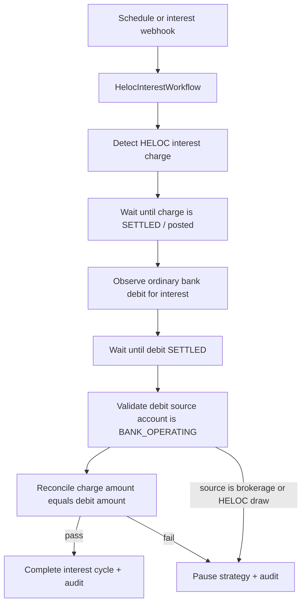
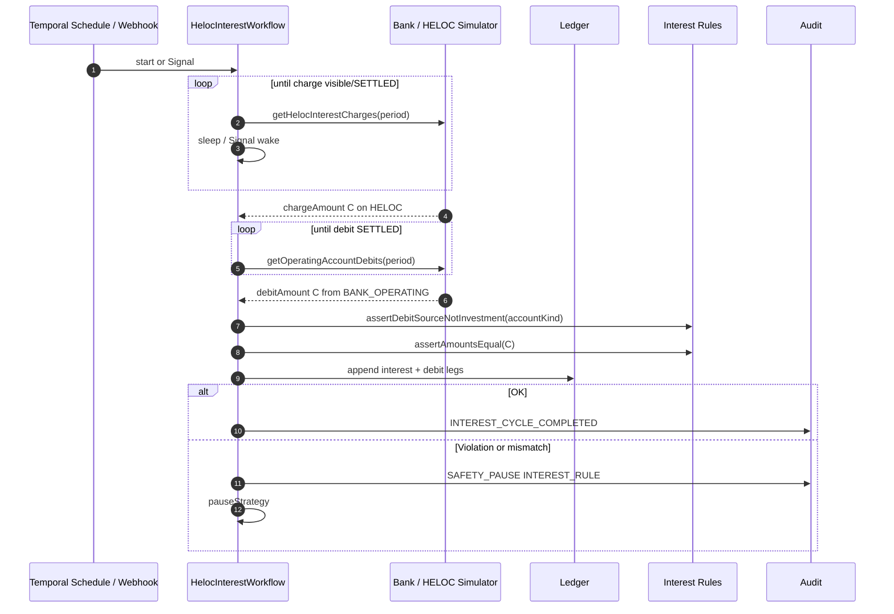

# HELOC Interest Workflow

## Purpose

Confirm and reconcile **HELOC interest** as a process **separate** from monthly investment conversion.

Critical invariant:

> Investment funds and HELOC draw proceeds must **never** be used to pay HELOC interest. Interest is charged on the HELOC and paid by debit from the user’s **ordinary bank account** (`BANK_OPERATING`).

## Why separate from conversion

| Reason                    | Detail                                                                                        |
| ------------------------- | --------------------------------------------------------------------------------------------- |
| Different trigger cadence | Interest may post on a bank schedule distinct from mortgage payment day                       |
| Different money trail     | Interest: HELOC interest charge + operating-account debit; Conversion: draw → brokerage → ETF |
| Failure isolation         | Interest NSF must not corrupt conversion ledger logic (though it may still pause strategy)    |
| Compliance clarity        | Makes the “no capitalization of interest via HELOC draw” rule auditable                       |

## Trigger model

- Temporal Schedule (e.g. expected interest posting window), and/or
- Bank webhook when an interest charge is posted → Signal to wake the workflow.

Workflow id (deterministic): `heloc-interest:{strategyId}:{interestPeriodId}`.

## Flow

## Interest-payment workflow diagram

## Validation rules

1. HELOC shows interest charge amount `C` (cents) for the period.
2. Ordinary bank shows debit `C` (or documented fee split policy—**MVP: exact match**).
3. Debit account kind ∈ {`BANK_OPERATING`} only.
4. Reject if debit is sourced from `BROKERAGE_CASH`, `BROKERAGE_POSITION` liquidation, or a HELOC **draw** intended for investment.
5. Conversion workflow must not create ledger entries that pay interest.
6. Capitalizing interest (drawing HELOC to pay interest) is a **non-goal** and a **safety pause** if detected by monitors.

## Interaction with monthly conversion

- No shared workflow state machine.
- Shared **strategy pause** flag: either workflow may pause.
- Reconciliation monitors may run a cross-check Activity: “no interest paid from investment accounts this period.”

## Observability

- Distinct `workflowType`, `interestCycleId`, correlation id.
- Metrics: interest confirm latency, NSF count, rule-violation pauses.

## Related documents

- [monthly-conversion-workflow.md](./monthly-conversion-workflow.md)
- [failure-model.md](./failure-model.md)
- [domain-glossary.md](./domain-glossary.md)
