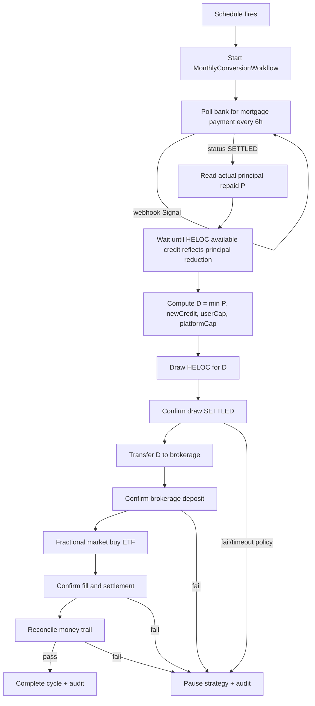
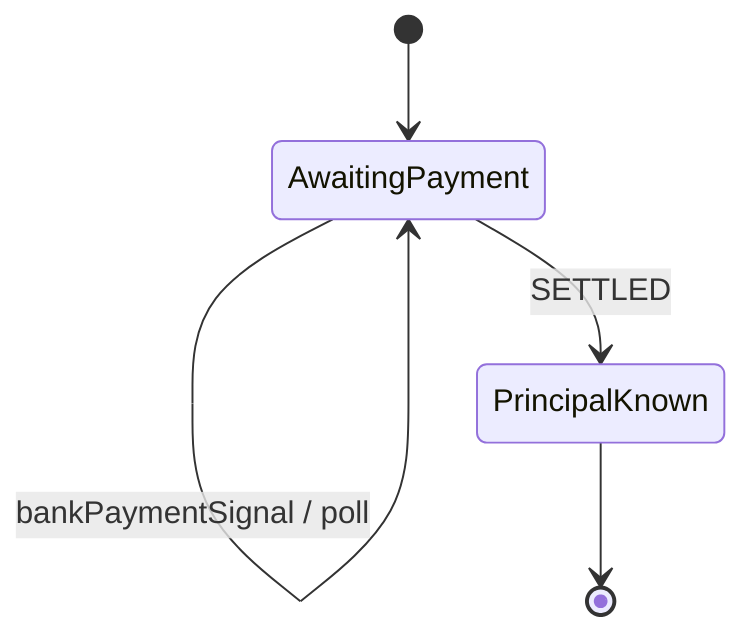
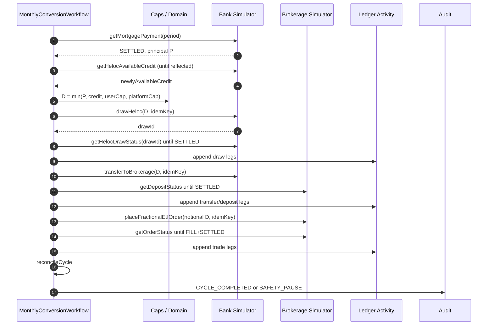

# Monthly Conversion Workflow

## Purpose

Automate one Smith Manoeuvre **debt-conversion cycle** for a single strategy and mortgage payment period: detect settled mortgage payment, unlock HELOC capacity, draw a capped amount, fund the non-registered brokerage, purchase the configured simulated ETF, reconcile the money trail, and complete—or pause the strategy on safety failure.

## Trigger model

1. A **Temporal Schedule** fires shortly after the user’s **expected mortgage-payment date** (IANA timezone on the strategy).
2. The Schedule **does not assume** the payment has settled.
3. Workflow id is deterministic: `conversion:{strategyId}:{paymentPeriodId}` to enforce **at most one active cycle** per strategy and period (see ADR-0009).

Preferred lifecycle: **independent monthly cycle workflows** started by Schedule (see ADR-0008).

## High-level flow

## Detailed steps

| Step                 | Actor                         | Success criteria                                                                              | Failure / safety                                              |
| -------------------- | ----------------------------- | --------------------------------------------------------------------------------------------- | ------------------------------------------------------------- |
| 1 Start              | Schedule                      | Workflow started; cycle row `SCHEDULED`→`AWAITING_MORTGAGE_PAYMENT`                           | Duplicate workflow id rejected/idempotent                     |
| 2 Poll mortgage      | Activity + Workflow timer     | Observe payment for period; continue until `SETTLED`                                          | Permanent `FAILED` payment → pause                            |
| 2b Signal            | API webhook → Temporal Signal | Signal wakes poll early; still verifies via GET                                               | Duplicate event id ignored                                    |
| 3 Principal          | Activity                      | Integer cents `principalRepaid` from bank                                                     | Missing principal → pause                                     |
| 4 HELOC credit wait  | Poll / condition              | Available credit increase reflects principal reduction                                        | Timeout SLA exceeded → pause                                  |
| 5 Caps               | Domain (pure)                 | `D = min(P, newlyAvailableCredit, userCap, platformCap)`; if `D=0`, complete no-op with audit | Negative inputs impossible via validation                     |
| 6 Draw               | Activity POST + confirm       | Draw `SETTLED` for amount `D`                                                                 | Timeout → reconcile before retry; fail → pause                |
| 7 Transfer           | Activity                      | Funds move HELOC/bank rail → brokerage cash                                                   | Same idempotency rules                                        |
| 8 Deposit confirm    | Activity                      | Brokerage deposit `SETTLED` for `D`                                                           | Mismatch amount → pause                                       |
| 9 Order              | Activity                      | Notional fractional market buy of configured ETF                                              | Reject if deposit unsettled                                   |
| 10 Fill + settlement | Activity                      | Fill confirmed and position/cash settled per sim rules                                        | Fail → pause                                                  |
| 11 Reconcile         | Activity + domain             | Full trail balanced; invariants hold                                                          | Fail → pause                                                  |
| 12 Audit             | Activity                      | Immutable audit record written                                                                | If audit write fails, retry Activity; do not hide money state |

## Durable polling + webhook Signal

- Workflow uses `condition` / timer loop sleeping **six hours** between polls.
- Optional `bankPaymentSignal` interrupts sleep so the workflow checks immediately.
- Signal is an optimization only; **truth is always the Activity GET**.

## Transfer sequence

## Workflow vs Activity split

| In Workflow                              | In Activities                             |
| ---------------------------------------- | ----------------------------------------- |
| Timers / sleep 6h                        | All bank & brokerage HTTP/DB              |
| `condition` wait for Signal              | Ledger writes                             |
| Sequencing & branching                   | Strategy load, pause flag writes          |
| Deterministic workflow id / search attrs | Idempotency key persistence               |
| Versioning patches                       | Random/demo failure draws (seeded in sim) |

## Caps formula

\[
D = \min(P, C\_{\text{new}}, U, \Pi)
\]

Where:

- \(P\) — actual principal repaid on the settled mortgage payment (cents)
- \(C\_{\text{new}}\) — newly available HELOC credit attributable to that principal reduction (cents)
- \(U\) — user monthly cap (cents)
- \(\Pi\) — platform monthly cap (cents)

If \(D = 0\), the cycle completes successfully as a **no-draw cycle** with audit code `NO_DRAW_CAPACITY`.

## Completion and pause

- **Complete:** cycle `COMPLETED`; Schedule continues to next period.
- **Pause:** strategy `PAUSED`; Schedule paused or start-hook no-ops; user/ops must clear reason to resume.

## Related ADRs

- ADR-0001 Temporal Schedule
- ADR-0002 Durable polling + Signal
- ADR-0007 One workflow per monthly cycle
- ADR-0008 Coordinator vs independent cycles
- ADR-0009 At-most-one active cycle per strategy and payment period
