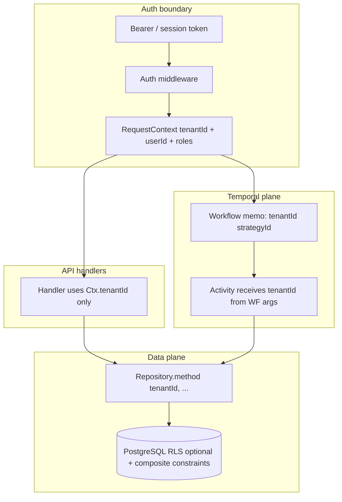

# Security and Tenancy

## Principles

1. **Never trust `tenantId` from request bodies alone.**
2. Derive tenant (and user) context from **authenticated identity**.
3. Every user-owned table includes `tenantId`.
4. Every repository method **requires** `tenantId` as an explicit argument.
5. Database constraints are a final defence (composite FKs / composite unique keys including `tenantId` where applicable).
6. Do not store access tokens or credentials in Temporal Workflow input or history.
7. Do not log credentials, tokens, full account numbers, or sensitive personal data.
8. Store provider payloads only after **redaction**.

## Tenant isolation diagram



## Identity model (MVP)

| Entity       | Description                                                  |
| ------------ | ------------------------------------------------------------ |
| `Tenant`     | Isolation root (household or advisory firm)                  |
| `User`       | Login principal                                              |
| `Membership` | `userId` + `tenantId` + role (`OWNER`, `MEMBER`, `OPS_READ`) |

API middleware resolves token → `userId` → active membership → **`tenantId`**.

Optional later: user belongs to multiple tenants with explicit tenant selection header that is **verified** against membership (header alone is insufficient).

## Repository contract

```typescript
// Illustrative — documentation only
interface LedgerRepository {
  append(tenantId: TenantId, entries: LedgerEntryInput[]): Promise<void>;
  listByCycle(tenantId: TenantId, cycleId: CycleId): Promise<LedgerEntry[]>;
}
```

Forbidden patterns:

- `findById(id)` without tenant predicate
- Accepting `tenantId` from Zod body as the sole authority
- Global admin queries in the same codepath without a distinct `PlatformOps` port and audit

## Webhook security

Bank/broker simulators call `POST /webhooks/...` with:

1. Shared secret or signature header.
2. Provider event id for idempotency.
3. External account id → **server-side mapping table** → `{tenantId, strategyId, accountId}`.

Webhook body must **not** be trusted for tenant routing.

On success, API sends Temporal **Signal** to the deterministic workflow id (if running) or records an event for the next poll.

## Temporal tenancy

- Workflow args include `tenantId` + `strategyId` (non-secret identifiers).
- Search attributes/memo enable ops filters by tenant.
- Activities re-load strategy by `(tenantId, strategyId)` and refuse mismatches.
- Worker is not multi-tenant-isolated at process level in MVP; isolation is data-plane enforced. Production evolution may shard workers by tenant tier later.

## Secrets handling

| Secret                     | Store                                       | Never in                             |
| -------------------------- | ------------------------------------------- | ------------------------------------ |
| DB URL                     | Env / secret manager                        | Workflow history, logs               |
| Webhook signing key        | Env / secret manager                        | Client payloads, WF input            |
| Future provider API tokens | Secret manager; Activities fetch at runtime | WF input/history, audit raw payloads |

## PII and redaction

Redact before log or `providerPayload` persist:

- passwords, tokens, `authorization`
- full account numbers (keep last4 if needed)
- SIN / government ids
- raw session cookies

See `@csm/shared` redaction helpers (Phase 0).

## Authorization matrix (MVP)

| Action                     | OWNER | MEMBER | OPS_READ | Platform ops            |
| -------------------------- | ----- | ------ | -------- | ----------------------- |
| Create/activate strategy   | ✓     | ✓      |          |                         |
| View cycles / ledger trail | ✓     | ✓      | ✓        | ✓ (break-glass audited) |
| Resume from safety pause   | ✓     |        |          | ✓                       |
| Change platform cap        |       |        |          | ✓                       |
| Impersonate tenant         |       |        |          | Separate tool + audit   |

## Threat notes (MVP scope)

| Threat                      | Mitigation                       |
| --------------------------- | -------------------------------- |
| Cross-tenant IDOR           | tenant predicate + tests         |
| Replay webhooks             | provider event id uniqueness     |
| Duplicate draws             | idempotency keys + DB unique     |
| Workflow argument tampering | Activities re-validate ownership |
| Log exfiltration            | redaction + no secrets in WF     |

## Related

- [failure-model.md](./failure-model.md)
- ADR-0003 PostgreSQL
- ADR-0006 Append-only ledger
