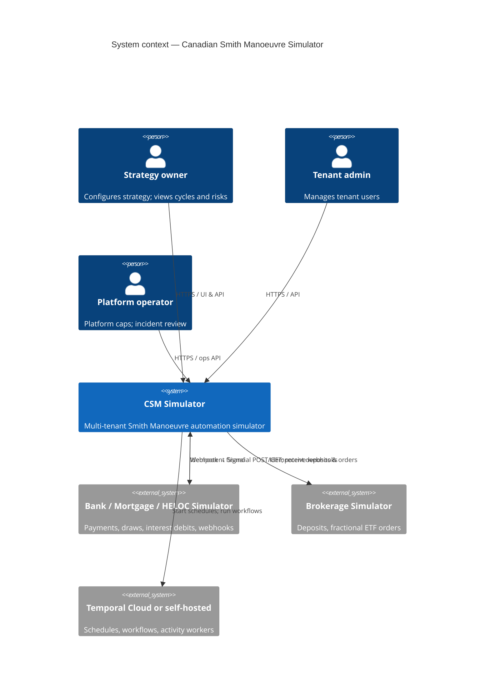
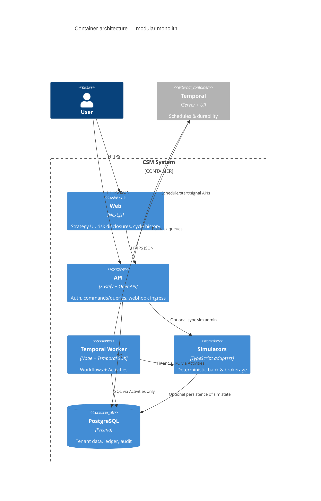
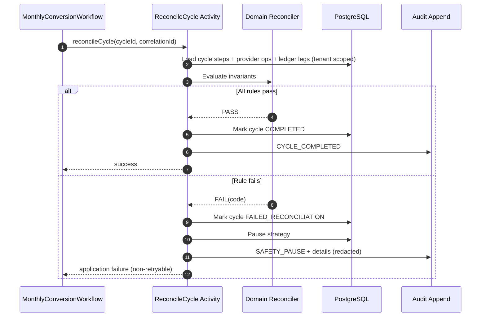
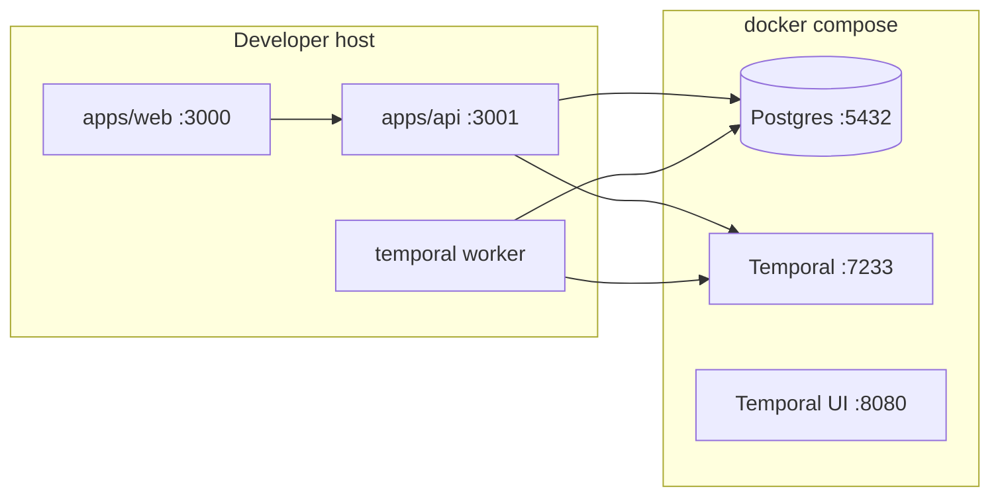

# System Architecture

## 1. Summary

A **modular monolith** with **separate deployable processes** (API, Temporal worker, optional Next.js web) sharing one PostgreSQL database and one Temporal cluster. Financial side effects execute only in **Activities**. **Workflows** orchestrate durable waits, signals, and compensation/pause decisions. Domain services enforce invariants. Simulators stand in for bank and brokerage providers.

## 2. System context



### Context notes

- In MVP, “external” bank and brokerage are **in-process or sidecar simulators** owned by this repo, not real institutions.
- Temporal may be local Docker (dev) or managed Temporal (production evolution).

## 3. Bounded contexts

| Context                      | Responsibility                                                        | Owns                                                        |
| ---------------------------- | --------------------------------------------------------------------- | ----------------------------------------------------------- |
| **Identity & Tenancy**       | AuthN/AuthZ, tenant membership, derive `tenantId`                     | Tenants, users, memberships, API keys (hashed)              |
| **Strategy**                 | Strategy config, caps, ETF target, schedule identity, pause/resume    | Strategy, schedule bindings, pause state                    |
| **Accounts & Ledger**        | Chart of simulated accounts, append-only ledger, balances projections | Accounts, ledger entries, balance snapshots                 |
| **Banking Simulation**       | Mortgage payments, HELOC credit/draw/interest, ordinary bank debits   | Bank provider adapter, payment/draw records (tenant-scoped) |
| **Brokerage Simulation**     | Deposits, market orders, fills, settlement                            | Broker adapter, orders, positions (tenant-scoped)           |
| **Conversion Orchestration** | Monthly conversion workflow lifecycle                                 | Cycle runs, Temporal workflow IDs, step status              |
| **Interest Orchestration**   | HELOC interest confirmation workflow                                  | Interest runs, debit linkage                                |
| **Reconciliation & Audit**   | Money-trail rules, immutable audit events, safety pauses              | Reconciliation reports, audit log                           |
| **Observability**            | Correlation IDs, metrics, structured logs                             | Cross-cutting (no proprietary domain tables)                |

Contexts communicate through **application services / ports**; Workflows never reach into DB repositories directly.

## 4. Container architecture



### Deployable processes (MVP)

| Process                          | Package / app            | Role                   |
| -------------------------------- | ------------------------ | ---------------------- |
| `apps/web`                       | Next.js                  | UI                     |
| `apps/api`                       | Fastify                  | HTTP API + webhooks    |
| `packages/temporal` worker entry | Temporal worker          | Workflows + Activities |
| Docker Compose                   | Postgres + Temporal + UI | Local platform         |

Shared libraries: `@csm/shared`, `@csm/domain`, `@csm/db`, `@csm/simulators`.

## 5. Service boundaries (logical modules)

Even as a modular monolith, module rules are enforced by package imports:

```
apps/web  → apps/api (HTTP only)
apps/api  → domain, db, shared, temporal (client), simulators (admin/test hooks)
worker    → domain, db, shared, simulators, temporal (workflows/activities)
domain    → shared only (no db, no temporal, no http)
db        → shared (+ Prisma)
simulators→ shared (+ optional db for durable sim state)
```

**Workflows** import only workflow-safe modules (activity proxies, signals, pure types).  
**Activities** call domain services + repositories + simulator adapters.

## 6. Temporal Workflow and Activity boundaries

### Workflows (deterministic orchestration)

| Workflow                                | Trigger                                      | Purpose                                                                   |
| --------------------------------------- | -------------------------------------------- | ------------------------------------------------------------------------- |
| `MonthlyConversionWorkflow`             | Temporal Schedule (preferred)                | One mortgage payment period conversion cycle                              |
| `HelocInterestWorkflow`                 | Schedule or event from bank interest posting | Confirm HELOC interest charge + ordinary-account debit                    |
| `StrategyPauseWorkflow` (optional thin) | Signal/command                               | Centralize pause fan-out; may instead be an Activity from either workflow |

### Activities (all I/O and non-determinism)

Examples (non-exhaustive):

- `getMortgagePayment` / `listRecentMortgagePayments`
- `getHelocAvailableCredit` / `confirmHelocReflectsPrincipal`
- `drawHeloc` / `getHelocDrawStatus`
- `transferToBrokerage` / `getTransferStatus` / `getBrokerageDepositStatus`
- `placeFractionalEtfOrder` / `getOrderStatus`
- `loadStrategyCaps` / `computeDrawAmount` (compute may be pure domain called from Activity or Workflow if pure)
- `writeLedgerEntries` / `reconcileCycle` / `appendAuditEvent` / `pauseStrategy`
- `recordInterestCharge` / `confirmInterestBankDebit`

**Rule:** timed-out financial POSTs → Activity outcome `TIMEOUT` → reconcile by GET/status before any retry with same idempotency key semantics.

## 7. Data ownership

| Data                                       | Owner module               | Notes                                                |
| ------------------------------------------ | -------------------------- | ---------------------------------------------------- |
| Tenant, User, Membership                   | Identity                   | `tenantId` root                                      |
| Strategy, caps, ETF, timezone, payment day | Strategy                   | Soft FK to account IDs                               |
| Account, LedgerEntry                       | Accounts & Ledger          | Append-only entries; balances derived or snapped     |
| ConversionCycle, CycleStep                 | Conversion Orchestration   | Links to Temporal `workflowId` / `runId`             |
| InterestCycle                              | Interest Orchestration     | Separate from conversion                             |
| ProviderOperation                          | Banking/Brokerage adapters | Idempotency key unique per tenant+provider+operation |
| AuditEvent                                 | Audit                      | Immutable; redacted payloads                         |
| SimulatorScenario                          | Simulators                 | Named packs for tests/demos                          |

**Temporal history** stores orchestration decisions and non-sensitive step results. **Never** store access tokens, credentials, or full PANs in workflow input/history.

## 8. Account and transaction model

### Account kinds

| Kind                 | Role in MVP                                                                                                 |
| -------------------- | ----------------------------------------------------------------------------------------------------------- |
| `MORTGAGE`           | Tracks principal; payment events produce principal repaid                                                   |
| `HELOC`              | Revolving credit; available credit increases as mortgage principal falls; draw increases HELOC balance owed |
| `BANK_OPERATING`     | Ordinary chequing/savings; source of HELOC interest debit                                                   |
| `BROKERAGE_CASH`     | Non-registered cash awaiting investment                                                                     |
| `BROKERAGE_POSITION` | ETF holdings (quantity as decimal string)                                                                   |

### Money model

- Currency: **CAD only** in MVP.
- Amounts: **integer cents** (`bigint`).
- Security quantities: **string decimal** (e.g. `"1.234567"`).
- No floating-point arithmetic for money.

### Ledger entry (append-only)

Each entry includes at minimum:

- `tenantId`, `entryId`, `createdAt` (UTC)
- `accountId`, `amountCents` (signed: credit/debit convention documented in glossary)
- `correlationId`, `cycleId` / `interestCycleId` (nullable)
- `providerOperationId` (nullable)
- `idempotencyKey` (nullable but unique when present)
- `narrative` (non-sensitive)

**Transfers** are two (or more) balanced ledger legs in one atomic write when internal; external provider mirrors also recorded as legs upon confirmation.

## 9. Multi-tenant security model

See [security-and-tenancy.md](./security-and-tenancy.md). Headline rules:

- Derive `tenantId` from authenticated identity.
- Every user-owned table and every repository method requires `tenantId`.
- Webhook handlers authenticate provider signatures and map external account → tenant via server-side lookup (never trust body `tenantId`).

## 10. Idempotency model

| Concern                                | Approach                                                                                                          |
| -------------------------------------- | ----------------------------------------------------------------------------------------------------------------- |
| Financial POST (draw, transfer, order) | Client-generated UUID idempotency key; unique DB constraint `(tenantId, provider, operationType, idempotencyKey)` |
| Timeout                                | Do **not** mint a new key; reconcile via status GET using same key / provider operation id                        |
| Webhook delivery                       | Idempotent consumer keyed by provider event id                                                                    |
| Workflow start                         | Deterministic Temporal `workflowId` = `conversion:{strategyId}:{paymentPeriodId}`                                 |
| Ledger write                           | Insert-only; conflict on unique keys is success-if-same, fail-if-different                                        |

## 11. Reconciliation model

See diagrams below and [failure-model.md](./failure-model.md).

Reconciliation for a conversion cycle verifies:

1. Settled mortgage payment principal `P`.
2. HELOC available-credit increase covers draw.
3. Confirmed HELOC draw amount `D = min(...)`.
4. Transfer amount `D` matched to brokerage deposit.
5. Order notional ≈ deposited cash (within documented tolerance policy; MVP: exact cents for marketable sim fill).
6. Ledger legs sum to zero across the cycle’s referenced accounts (balanced trail).
7. No interest debit funded from brokerage/HELOC-draw proceeds in the same period checks.

Failure → strategy `PAUSED` + audit reason codes.

### Reconciliation sequence



## 12. State machines

### Strategy

```
DRAFT → ACTIVE ⇄ PAUSED → ARCHIVED
```

- `ACTIVE`: Schedule enabled.
- `PAUSED`: Schedule paused or no-ops starts; no new draws.

### Conversion cycle

```
SCHEDULED → AWAITING_MORTGAGE_PAYMENT → AWAITING_HELOC_CREDIT
  → DRAWING → TRANSFERRING → INVESTING → RECONCILING
  → COMPLETED
  → PAUSED_SAFETY (terminal for this cycle; strategy paused)
  → CANCELLED (manual / strategy archived)
```

### Provider operation

```
CREATED → SUBMITTED → (SETTLED | FAILED | TIMED_OUT_NEEDS_RECONCILE)
TIMED_OUT_NEEDS_RECONCILE → SETTLED | FAILED
```

### Mortgage payment / HELOC draw / deposit / order

Simulator statuses include at least: `PENDING`, `SETTLED`, `FAILED`, `CANCELLED`.

## 13. Observability strategy

- **Correlation ID** (`x-correlation-id`) on API → Workflow memo/search attributes → Activities → simulator calls → ledger/audit.
- Structured JSON logs (`service`, `level`, `tenantId`, `strategyId`, `cycleId`, `workflowId`, `runId`).
- Metrics: cycle success/fail, pause counts, activity latency, reconcile fail codes, webhook→signal lag.
- Temporal UI for workflow timelines; never log secrets.
- Provider payloads stored **redacted**.

## 14. Audit and money-tracing strategy

- **AuditEvent**: append-only, human+machine readable (`code`, `actorType`, `correlationId`, `payloadRedacted`).
- **Ledger**: financial source of truth for balances.
- Money trace for a cycle: join `ConversionCycle` → `ProviderOperation` → `LedgerEntry` by `cycleId` + `correlationId`.
- Customer UI shows the trail without implying tax deductibility or guaranteed returns.

## 15. Simulator scenario model

| Concept            | Description                                                                         |
| ------------------ | ----------------------------------------------------------------------------------- |
| Scenario pack      | Named set of scripts: payment settle day, HELOC lag, fill price, failure injections |
| Deterministic mode | Fixed clock offsets & outcomes from scenario id (tests)                             |
| Demo mode          | Seeded PRNG failures (seed in scenario; Activities only—not Workflows)              |
| Clocks             | Simulator uses injected clock / Temporal activity “now” from side effect            |

Scenarios cover: happy path, late settlement, HELOC credit lag, draw timeout+reconcile, deposit fail, partial fill policy (MVP: reject partial), interest debit NSF, webhook duplicates.

## 16. Testing pyramid

```
           E2E (Compose: API + Worker + Temporal + Postgres + Sims)
              / \
             /   \
    Workflow tests (Temporal test env)   API contract tests
             \   /
              \ /
         Domain unit tests (cents, caps, reconcile rules)
              |
         Shared unit tests (money, env, redact)
```

- Prefer deterministic scenario packs at workflow and E2E layers.
- Property: `draw = min(P, credit, userCap, platformCap)`.

## 17. Local Docker architecture



Compose provides Postgres + Temporal + Temporal UI. App processes typically run on host via pnpm for fast iteration; optional app containers later.

## 18. Production evolution path

1. **Now**: Modular monolith, local Temporal, in-repo simulators.
2. **Next**: Managed Temporal; hardened auth (OIDC); encrypted secrets manager for any future provider credentials (still not in workflow history).
3. **Later**: Extract simulators behind HTTP if needed; still not real banks.
4. **Not planned for this product line**: real-money rails (see non-goals). If ever pursued, would be a separate system with new ADRs, PCI/regulatory design—out of scope.

## 19. Proposed monorepo structure

```
apps/
  api/                 # Fastify OpenAPI
  web/                 # Next.js
packages/
  shared/              # money, errors, logging, env, correlation
  domain/              # invariants, draw math, reconcile rules, state machines
  db/                  # Prisma schema, migrations, tenant-scoped repos
  simulators/          # bank, heloc, brokerage, scenarios
  temporal/            # workflows, activities, worker, schedules
docs/                  # this documentation set
docker/                # Temporal dynamicconfig, etc.
```

Matches Phase 0 scaffold already present in the repository.

## 20. Implementation order

1. **Phase 0** — Tooling & shared libs _(done)_
2. **Phase 1** — Prisma schema, ledger, tenancy repos, migrations
3. **Phase 2** — Simulators + deterministic scenarios + idempotency store
4. **Phase 3** — Domain services (draw, reconcile, pause, interest rules)
5. **Phase 4** — Temporal workflows/activities/schedules (conversion + interest)
6. **Phase 5** — Fastify API, OpenAPI, webhooks → signals, auth → tenant
7. **Phase 6** — Next.js UI + risk disclosures
8. **Phase 7** — Hardening, E2E, redaction review, ops runbooks

## 21. Unresolved questions

1. Auth mechanism for MVP (local JWT vs OIDC provider stub)?
2. Exact HELOC “newly available credit” measurement window (snapshot before payment vs delta since last cycle)?
3. Order settlement semantics in simulator: is `FILL` sufficient or is a separate `SETTLED` cash/position required before reconcile? (PR assumes both confirmed.)
4. Should platform monthly cap be global or per-tenant tier?
5. Retention period for redacted provider payloads and audit events?
6. Multi-strategy per user in MVP or single strategy? (Architecture allows many; product may ship one.)
7. How NSF on interest debit interacts with conversion pause (hard pause vs warn-only)?

## 22. Acceptance criteria — complete MVP

- [ ] Docker Compose brings up Postgres + Temporal + Temporal UI.
- [ ] Tenant-scoped strategy can be created; Schedule registered in user IANA timezone.
- [ ] Monthly conversion workflow polls every 6 hours until mortgage payment `SETTLED`, and can be advanced early via authenticated bank webhook Signal.
- [ ] Draw equals min of principal, newly available HELOC credit, user cap, platform cap (integer cents).
- [ ] HELOC draw confirmed before transfer; deposit confirmed before order; fill+settlement confirmed before success.
- [ ] Reconciliation passes on happy path; failures pause strategy with audit codes.
- [ ] Interest workflow confirms HELOC interest charge and ordinary bank debit; conversion never pays interest from investment/HELOC-draw funds.
- [ ] Timed-out financial POST is reconciled before retry; uniqueness constraints prevent duplicate money movement.
- [ ] No secrets in Temporal history; logs/payloads redacted.
- [ ] Deterministic scenario tests cover happy path + timeout-reconcile + pause-on-reconcile-fail + duplicate webhook.
- [ ] UI/API copy discloses leverage, debt, interest, and investment risk.
- [ ] Automated tenancy tests prove cross-tenant read/write denial.

## Diagrams index

- System context — §2
- Container architecture — §4
- Transfer sequence — [monthly-conversion-workflow.md](./monthly-conversion-workflow.md)
- Monthly / interest workflows — respective docs
- Failure recovery — [failure-model.md](./failure-model.md)
- Tenant isolation — [security-and-tenancy.md](./security-and-tenancy.md)
